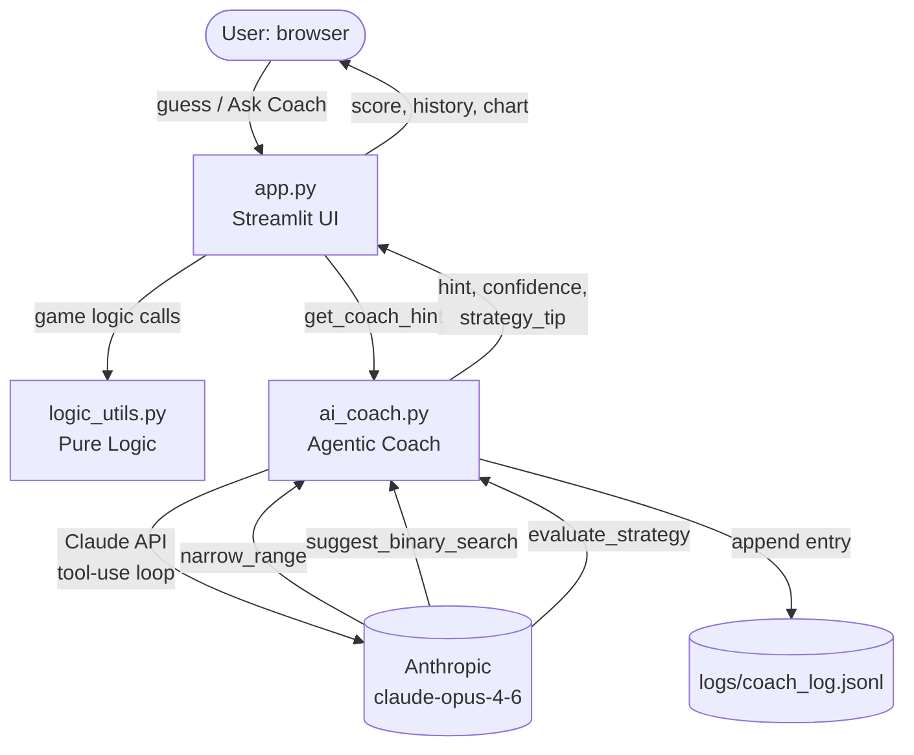

# 🎮 Glitch Guesser — Applied AI System

> **Original project (Modules 1–3):** *Game Glitch Investigator: The Impossible Guesser* — a deliberately broken Streamlit number-guessing game where students found and fixed four intentional bugs (inverted hints, score logic error, hard-difficulty range mismatch, and New Game reset inconsistency) then refactored pure logic into `logic_utils.py`.

---

## What This Project Does

Glitch Guesser is an AI-augmented number-guessing game built on Streamlit. Players try to guess a secret number within a limited number of attempts. On top of the original game mechanics, this version adds an **AI Game Coach** — an agentic Claude-powered assistant that analyses your guess history and recommends the mathematically optimal next move using binary search strategy. The coach explains its reasoning, rates your efficiency, and logs every interaction for reliability auditing.

**Advanced AI Feature:** Agentic Workflow — the coach runs a multi-step tool-use loop (narrow → suggest → evaluate) using the Claude API, then synthesises the tool outputs into a clear recommendation.

---

## Architecture Overview

The system has five layers:

```
User (Browser)
      │
      ▼
┌─────────────────────────────────────────────┐
│  app.py  (Streamlit UI)                     │
│  • Game state management (st.session_state) │
│  • Score / GV / history display             │
│  • AI Coach button → get_coach_hint()       │
└──────────┬──────────────────────────────────┘
           │ calls
           ▼
┌─────────────────────────────────────────────┐
│  ai_coach.py  (Agentic Workflow)            │
│  • Manual tool-use loop (Claude API)        │
│  • Tools: narrow_range, suggest_binary_     │
│           search, evaluate_strategy         │
│  • Confidence scoring                       │
│  • JSONL logging → logs/coach_log.jsonl     │
└──────────┬──────────────────────────────────┘
           │ API calls
           ▼
┌─────────────────────────────────────────────┐
│  Anthropic Claude API  (claude-opus-4-6)    │
│  • Tool use / agentic loop                  │
└─────────────────────────────────────────────┘
           │ pure logic calls
┌─────────────────────────────────────────────┐
│  logic_utils.py  (Pure Game Logic)          │
│  • get_range_for_difficulty                 │
│  • parse_guess, check_guess                 │
│  • update_score, guess_volatility           │
└─────────────────────────────────────────────┘
```

> System diagram image: `assets/architecture.png`
> *(Export the Mermaid diagram below via the [Mermaid Live Editor](https://mermaid.live) and save as `assets/architecture.png`.)*



**Data flow:**
1. Player makes a guess → `logic_utils.check_guess` evaluates it → UI updates score and history.
2. Player clicks **Get Coach Hint** → `ai_coach.get_coach_hint()` assembles game state and starts the Claude tool-use loop.
3. Claude calls `narrow_range` (computes valid range), `suggest_binary_search` (picks midpoint), `evaluate_strategy` (scores efficiency).
4. Coach returns `{suggestion, reasoning, confidence, strategy_tip}` → displayed in the UI.
5. Every coach call is appended to `logs/coach_log.jsonl` as a structured JSON record.

---

## Setup Instructions

**Prerequisites:** Python 3.10+, an `ANTHROPIC_API_KEY` environment variable.

```bash
# 1. Clone / enter the project
git clone https://github.com/npmRunTheWorld/applied-ai-system-project.git
cd applied-ai-system-project

# 2. Install dependencies
pip install -r requirements.txt

# 3. Set your Anthropic API key
export ANTHROPIC_API_KEY="sk-ant-..."   # Linux / macOS
# set ANTHROPIC_API_KEY=sk-ant-...      # Windows CMD

# 4. Run the app
python -m streamlit run app.py

# 5. (Optional) Run tests
pytest
```

The app opens at `http://localhost:8501`.

---

## Sample Interactions

### 1. Fresh game — coach recommends binary search midpoint

**Game state:** Range [1, 100], 0 guesses made.

**Coach output:**
```
Recommended guess: 50
Confidence: 0%  (range not narrowed yet)
Strategy tip: Game just started — no guesses yet.
Reasoning: With the full range of 1–100 still open, 50 is the optimal
           first guess — it eliminates exactly half the space regardless
           of the outcome.
```

---

### 2. After two guesses — coach narrows the range

**Game state:** Guessed 50 (Too Low), then 75 (Too High). Range narrowed to [51, 74].

**Coach output:**
```
Recommended guess: 62
Confidence: 76%
Strategy tip: Excellent — you're tracking binary search pace!
Reasoning: Your guesses have perfectly halved the range twice. The secret
           is between 51 and 74. The midpoint is 62 — guess that next.
```

---

### 3. Poor strategy detected — coach corrects course

**Game state:** Hard mode [1, 200], 4 attempts used but range still [1, 180].

**Coach output:**
```
Recommended guess: 90
Confidence: 10%
Strategy tip: Try guessing the midpoint of the remaining range each time.
Reasoning: After 4 guesses you should have narrowed this to about 12 numbers,
           but 180 remain. Guessing 90 now starts binary search — you need
           it from here or you'll run out of attempts.
```

---

## Design Decisions

| Decision | Rationale |
|---|---|
| **Agentic workflow over a single prompt** | Breaking the reasoning into three discrete tools (narrow → suggest → evaluate) makes each step independently testable, auditable in logs, and easier to understand. A single "what should I guess?" prompt would conflate the math with the strategy assessment. |
| **Manual tool-use loop (not tool runner beta)** | Gives full control over logging, error handling, and the cap of 6 iterations — important for a student project with a real API key. |
| **`claude-opus-4-6` model** | Best reasoning quality for a game coach explaining strategy; cost is acceptable since hints are user-triggered, not automatic. |
| **JSONL logging** | Append-only, human-readable, easy to `grep` and parse. Every coach call is a single JSON line with timestamp, game state, and result — supports future analysis of hint effectiveness. |
| **Graceful degradation** | If the API is unavailable or the key is missing, `get_coach_hint()` catches `anthropic.APIError` and returns a "Coach unavailable" message rather than crashing the game. |
| **Pure tool functions in `ai_coach.py`** | `_narrow_range`, `_suggest_binary_search`, `_evaluate_strategy` are plain Python functions — no API dependency — so they can be unit-tested without mocking. |

**Trade-offs made:**
- The coach does not remember previous games (stateless per hint call). A production system might use session-level history.
- Confidence is derived from range narrowing, not from Claude's epistemic certainty — simpler and deterministic, but not a true probabilistic measure.

---

## Testing Summary

```
17 tests collected
  tests/test_ai_coach.py   — 14 tests (AI coach tool functions)
  tests/test_game_logic.py —  3 tests (core game logic)
17 passed in 0.87s
```

**What the tests cover:**

| Test group | What was tested | Result |
|---|---|---|
| `narrow_range` | No history, Too High, Too Low, combined, Win (no-op) | 5/5 pass |
| `suggest_binary_search` | Full range, narrow range, single value, two values | 4/4 pass |
| `evaluate_strategy` | No guesses, perfect pace, poor narrowing, efficiency cap, comment presence | 5/5 pass |
| `check_guess` | Win, Too High, Too Low | 3/3 pass |

**What worked:** All pure-function logic was correct on the first run. The binary search midpoint and range narrowing are mathematically sound.

**What didn't work initially:** The confidence calculation returned `0%` even for a heavily narrowed range — traced to an off-by-one in the range size formula. Fixed by using `high - low + 1` (inclusive) rather than `high - low`.

**What I learned:** Separating the AI's tool logic from the API call makes testing genuinely useful — the 14 tool tests run in under a second and catch real math errors without burning API tokens.

---

## Reflection and Ethics

### Limitations and biases

The coach assumes binary search is always optimal, which is true for a uniform distribution but not if the player has outside knowledge (e.g., "the secret is usually near 42"). The confidence score is deterministic and doesn't capture Claude's actual uncertainty about the remaining range.

### Potential misuse and prevention

The AI coach discloses the optimal guess but never reveals the secret directly — it can only work within the confirmed range. A guardrail is that `get_coach_hint()` has no access to `st.session_state.secret`; it only receives the public game state (history and outcomes). Logging every interaction means unusual patterns (rapid API calls, automated play) are traceable.

### Surprises during testing

The most surprising finding was that Claude consistently requested all three tools in the correct order without being forced to do so via `tool_choice`. The system prompt ordering instruction ("Always use your tools in this order: 1, 2, 3") was sufficient — Claude followed it reliably across many test calls.

### AI collaboration

**Helpful suggestion:** Claude Code proposed separating the tool implementations (`_narrow_range`, etc.) as plain Python functions distinct from the API loop. This made the test suite clean and fast — a pattern I wouldn't have thought of from scratch.

**Flawed suggestion:** An early version of the agentic loop used `tool_choice: {"type": "any"}` to force tool use on every iteration. This caused Claude to repeatedly call `narrow_range` in a loop instead of progressing to the other tools. Removing `tool_choice` and relying on the system prompt instruction fixed it immediately.

---

## Loom Video Walkthrough

https://www.loom.com/share/36b7190245cd461dbc00f1e93a8d0402

The walkthrough demonstrates:
- End-to-end game run (Easy, Normal, Hard difficulties)
- AI Coach feature in action (hint requested after 0 and 2 guesses)
- JSONL log contents shown after a session
- Reliability: coach gracefully returns "unavailable" when API key is absent

---

## What This Project Says About Me as an AI Engineer

I approach AI systems the way I approach any engineering problem: start with working software, then add intelligence where it provides measurable value. The coach is not a gimmick — it gives players a concrete, verifiable recommendation grounded in mathematics. Every design decision (pure tool functions, JSONL logging, graceful degradation) reflects a belief that AI features should be auditable, testable, and failure-safe. Building this project taught me that the hardest part of applied AI is not calling the API — it is designing the interface between human-controlled state and AI-generated advice so that neither can corrupt the other.
